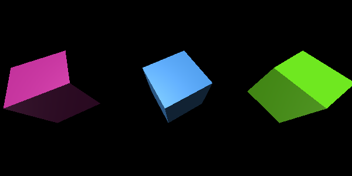

This is a collection of small collection of side-projects and scripts to explore different technologies in JavaScript.

### [dice_master](https://github.com/herokunt/javascript_ramblings/blob/main/dice.js)

A very simple script to simulate dice rolls. Create dice with any number of sides and optionally provide any numbers that should be re-rolled.

```js
const d20 = dice(20)
const d12 = dice(12)
const d6 = dice(6)

d20()   // 15
d12()   // 9
d6()    // 4

// Provide an array with numbers that should be re-rolled
d20([2,4,6,8,10])
d12([1,3,5])
d6([5,6])

/*
TODO: Make it avilable as CLI
TODO: Add option to create custom "sides" other than numbers
TODO: Animation using three.js
TODO: Add option to roll multiple dices at once         d12({ repeat: 5 })              // [7, 3, 9, 12, 3]
TODO: For multiple rolls, add option to sort results    d12({ repeat: 5, sort: true })  // [3, 3, 7, 9, 12]
TODO: For multiple rolls, add option to group results   d12({ repeat: 5, group: true }) // 2 threes, 1 seven, 1 nine, 1 twelve
*/
```
Update: started working on learning the fundamentals of Three.js


---

### [Solar System](https://github.com/herokunt/javascript_ramblings/blob/main/planets.js)

A solar system 3D simulation built with Three.js


### [No YouTube](https://github.com/herokunt/javascript_ramblings/blob/main/bookmarklets.js)

A simple bookmarklet that replaces references to Youtube in the current page with Invidious instances.
