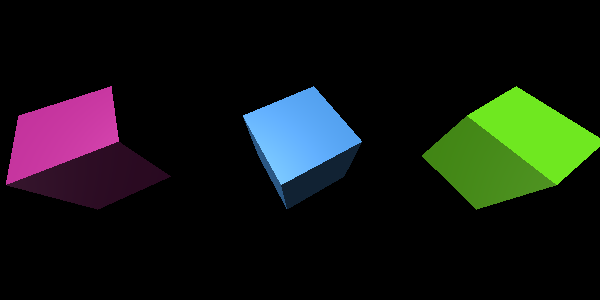
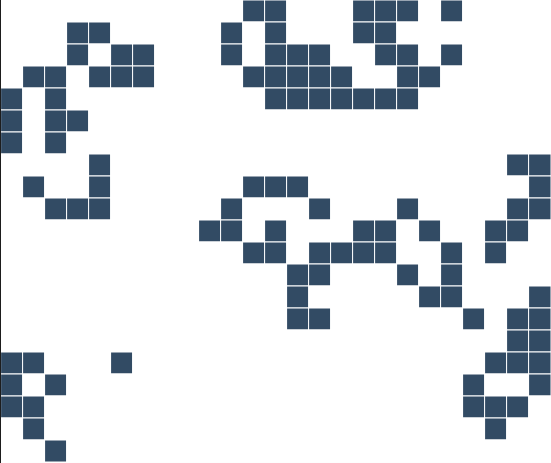
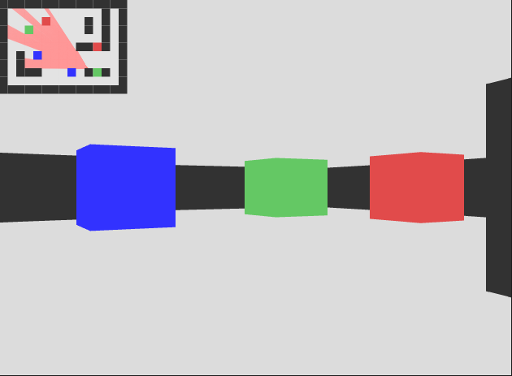

JavaScript Ramblings - a collection of small scripts made with the sole purpose of exploring different technologies in the JavaScript landscape.

---
### [dice_simulator](https://github.com/herokunt/javascript_ramblings/blob/main/dice.js)

Small, simple script to simulate dice rolls programatically. Create functions for every new type of dice you need, and provide parameters to adjust things like re-rolls or sorting results.

```js
const d20 = dice(20)
const d12 = dice(12)
const d6 = dice(6)

d20()   // 15
d12()   // 9
d6()    // 4

/**
  * Optionally provide an array of numbers to the roll to exclude those numbers
  * from the result, as if they were re-rolled.
  */

d20([2,4,6,8,10])
d12([1,3,5])
d6([5,6])
```

```
/*
TODO: Make it avilable as CLI
TODO: Add option to create custom "sides" other than numbers
TODO: Option to roll multiple dices at once:
d12({ repeat: 5 })  // [7, 3, 9, 12, 3]

TODO: Option to chain dices of differnt sides:
d6().d4().d3({ repeat: 2 })   // [5, 4, 1, 2]

TODO: For multiple rolls, add option to sort results:
d12({ repeat: 5, sort: true })    // [3, 3, 7, 9, 12]

TODO: For multiple rolls, add option to group results:
d12({ repeat: 5, group: true })   // 2 threes, 1 seven, 1 nine, 1 twelve

TODO: Animation using three.js
*/
```



---
### [Solar System](https://github.com/herokunt/javascript_ramblings/blob/main/3D/planets.js)

A simple 3D simulation of the solar system built with [Three.js](https://threejs.org) as an introduction to how the library works.


---
The following are exercises inspired by Daniel Shiffman and Gustavo Pezzi implementing slight modifications here and there to my own style including ES6+ syntax.

**[2D - Angry Birds](https://github.com/herokunt/javascript_ramblings/blob/main/2D/angry_birds.js)**: A (very) simplified clone of the popular game Angry Birds using Matter.js and P5.js as rendering engine. [See demo](https://editor.p5js.org/fall-parameter/sketches/aKA9ZXHO1)

**[2D - Angry Matter](https://github.com/herokunt/javascript_ramblings/blob/main/2D/angry_matter.js)**: An improvement over previous project, this version features p5.js wrappers over matter.js bodies to handle rendering and physics independently. [See demo](https://editor.p5js.org/fall-parameter/sketches/Q6PcOhQBl)


**[2D - Asteroids](https://github.com/herokunt/javascript_ramblings/blob/main/2D/asteroids.js)**: The classic 8-bit game Asteroids! [See demo](https://editor.p5js.org/fall-parameter/sketches/EBnF9Q-1N)

**[2D - Attraction](https://github.com/herokunt/javascript_ramblings/blob/main/2D/noc_physics.js)**: This basic demo uses p5.js to create an environment that simulates gravitational attraction between objects. [See demo](https://editor.p5js.org/fall-parameter/sketches/HmzJS_pB8)

**[2D - Attraction-Repulsion](https://github.com/herokunt/javascript_ramblings/blob/main/2D/noc_attraction.js)**: A variation exercise to include attracting and repulsive forces. [See demo](https://editor.p5js.org/fall-parameter/sketches/5bTOj2boj)

**[2D - Beesweeper](https://github.com/herokunt/javascript_ramblings/blob/main/2D/beesweeper.js)**: Version of the classic game of minesweeper, using bees instead of mines. [See demo](https://editor.p5js.org/fall-parameter/sketches/ExafupoVm)

**[2D - Binary Tree Visualization](https://github.com/herokunt/javascript_ramblings/blob/main/2D/binary_tree.js)**: A visualization of the binary search algorithm, through nodes that form a tree that can be traversed. [See demo](https://editor.p5js.org/fall-parameter/sketches/XZ8q5Uljy)

**[2D - Fireworks](https://github.com/herokunt/javascript_ramblings/blob/main/2D/fireworks.js)**: A firework simulation in the browser canvas [See demo](https://editor.p5js.org/fall-parameter/sketches/oQ_ScPSZq)

**[2D - Flock Simulation](https://github.com/herokunt/javascript_ramblings/blob/main/2D/flock_simulation.js)**: Simulation of how individual particles interact as a flock in a complex system [See demo](https://editor.p5js.org/fall-parameter/sketches/cq-M6CW1k)

**[2D - Flow Field](https://github.com/herokunt/javascript_ramblings/blob/main/2D/noc_flowfield.js)**: A follow along of Daniel Shiffman's The Nature Of Code playlist. This is a visual representation of 3-dimensional Perlin noise. [See demo](https://editor.p5js.org/fall-parameter/sketches/PxvmM0PMq)

**[2D - Forces](https://github.com/herokunt/javascript_ramblings/blob/main/2D/noc_forces.js)**: This basic demo uses p5.js to create an environment that simulates real world forces, such as gravity, wind, friction and drag. [See demo](https://editor.p5js.org/fall-parameter/sketches/5KQupIlIW)

**[2D - Game Of Life](https://github.com/herokunt/javascript_ramblings/blob/main/2D/game_of_life.js)**: Classic John Conway's Game Of Life, a zero-player game based on an initial input that evolves by itself based on a basic set of rules. [See demo](https://editor.p5js.org/fall-parameter/sketches/NLFQKHvjr)



**[2D - Hanging Lightbulb](https://github.com/herokunt/javascript_ramblings/blob/main/2D/hanging_lightbulb.js)**: Combines raycasting with phyiscs engine to cast shadow dynamically on moving objects. [See demo](https://editor.p5js.org/fall-parameter/sketches/iRAe03G1W)

**[2D - Joggler](https://github.com/herokunt/javascript_ramblings/blob/main/2D/joggler.js)**: Very simple game to mimic an interactive joggling in the canvas. [See demo](https://editor.p5js.org/fall-parameter/sketches/d5aRIpu00)

**[2D - Matrix Letter Effect](https://github.com/herokunt/javascript_ramblings/blob/main/2D/matrix_letters.js)**: The classic digital letter "rain" effect from the movie: The Matrix. [See demo](https://editor.p5js.org/fall-parameter/sketches/7RUbiCt1b)

**[2D - Maze Generator](https://github.com/herokunt/javascript_ramblings/blob/main/2D/maze_generator.js)**: A maze generator on the browser based on depth-first search recursive algorithm. [See demo](https://editor.p5js.org/fall-parameter/sketches/Y_IB8Scm4)


**[2D - Mitosis](https://github.com/herokunt/javascript_ramblings/blob/main/2D/mitosis.js)**: A simple simulation of the process of mitosis on cells. [See demo](https://editor.p5js.org/fall-parameter/sketches/8iVEnifrI)

**[2D - Non-overlapping circles](https://github.com/herokunt/javascript_ramblings/blob/main/2D/overlap.js)**: Fill the screen with circles that will never overlap with each other! [See demo](https://editor.p5js.org/fall-parameter/sketches/hm3joNACl)

**[2D - Perlin Noise](https://github.com/herokunt/javascript_ramblings/blob/main/2D/noc_perlin_noise.js)**: This is a visual representation of 2-dimensional Perlin noise. [See demo](https://editor.p5js.org/fall-parameter/sketches/oGkwnNowr)

**[2D - Phyllotaxis](https://github.com/herokunt/javascript_ramblings/blob/main/2D/phyllotaxis.js)**: A visualization of a common pattern found in nature such as the shape of some plants. [See demo](https://editor.p5js.org/fall-parameter/sketches/u7RBrO09p)

**[2D - Plinko](https://github.com/herokunt/javascript_ramblings/blob/main/2D/plinko.js)**: The game of Plinko built with Matter.js and P5.js as rendering engine. [See demo](https://editor.p5js.org/fall-parameter/sketches/FD9i-1nL0F)

**[2D - Quadtree](https://github.com/herokunt/javascript_ramblings/blob/main/2D/quadtree.js)**: Visualization of a quadtree data structure for optimized performance in simulations of interacting particle systems. [See demo](https://editor.p5js.org/fall-parameter/sketches/wPjwEOd-i)

**[2D - Raycasting Rendering](https://github.com/herokunt/javascript_ramblings/blob/main/2D/raycasting_3D.js)**: Implementation of raycasting algorithm in p5.js that projects wall a la Wolfenstein 3D [See demo](https://editor.p5js.org/fall-parameter/sketches/lDJjXSG6o)



**[2D - Raycasting](https://github.com/herokunt/javascript_ramblings/blob/main/2D/raycasting.js)**: Visualization of a light-emitting object using raycasting algorithm. [See demo](https://editor.p5js.org/fall-parameter/sketches/Mr6WzNe5E)

**[2D - Snowfall](https://github.com/herokunt/javascript_ramblings/blob/main/2D/noc_snowfall.js)**: A snowfall effect using p5.js inspired by Daniel Shiffman's The Nature Of Code playlist. [See demo](https://editor.p5js.org/fall-parameter/sketches/KHmqjD_gx)

**[2D - Snake](https://github.com/herokunt/javascript_ramblings/blob/main/2D/snake.js)**: Another classic 8-bit game. [See demo](https://editor.p5js.org/fall-parameter/sketches/_B_A8i0d1)

**[2D - Space Invaders](https://github.com/herokunt/javascript_ramblings/blob/main/2D/invaders.js)**: Another 8-bit classic game: space invaders!. [See demo](https://editor.p5js.org/fall-parameter/sketches/AULsRZPCm)


**[2D - Steering Behaviors](https://github.com/herokunt/javascript_ramblings/blob/main/2D/steering_behavior.js)**: Particle system where each particle reacts to it's environment in a "lifelike" manner. [See demo](https://editor.p5js.org/fall-parameter/sketches/Po7qTPFag)

---
### [Invidious bookmarklet](https://github.com/herokunt/javascript_ramblings/blob/main/bookmarklets.js)

A simple bookmarklet that replaces references to Youtube links in the current page with Invidious instances. This `https://youtu.be/70MQ-FugwbI` becomes `https://invidious.site/70MQ-FugwbI`
