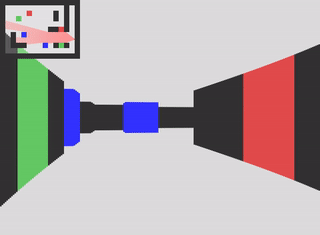

JavaScript Ramblings - a collection of small scripts made with the sole purpose of exploring different technologies in the JavaScript landscape.

---

### [text_transition](https://github.com/D10f/javascript_ramblings/blob/main/text_transition.js) | [.ts](https://github.com/D10f/javascript_ramblings/blob/main/text_transition.ts)

Changes the contents of the target HTML with a new value, transitioning characters individually in a random fashion.


---

### [masonry layout](https://github.com/D10f/javascript_ramblings/blob/main/masonry.js)

Vanilla JS implementation of a masonry layout. Does not handle any CSS styling it simply calculates and arranges the positions of the html elements inside a grid container.

```css
/* css */
.grid-container {
  display: grid;
  grid-template-columns: repeat(3, 1fr);
  gap: 1rem;
}
```

```js
/* js */
masonryLayout(".grid-container");
```

---

### [byte_size_parser](https://github.com/D10f/javascript_ramblings/blob/main/byte_size_parser.js)

A parser to convert strings of byte size into it's numeric value. Supports byte prefixes.

```js
parse("70 Mb") // Accepts shorthand syntax
> 70000000;

parse("0.1 peta") // Accepts partial syntax
> 100000000000000;

parse("2 tebibytes") // Accepts long syntax
> 2199023255552;

parse("5 Gibibytes") // Accepts byte prefixes (kibi-, mebi-, gibi-, ...)
> 5368709120;
```

---

### [color_converter](https://github.com/D10f/javascript_ramblings/blob/main/color_converter.js)

A simple color code converter from hexadecimal format to RGB color format, and vice-versa.

```js
hexToRgb("#56BCF1") // from hex to rgb
> "rgb(86, 188, 241)";

rgbToHex(86, 188, 241) // accepts numbers
> "#56BCF1";

rgbToHex("86", "188", "241") // accepts strings
> "#56BCF1";

rgbToHex([86, 188, 241]) // accepts an array
> "#56BCF1";
```

---

### [shuffle_arrays](https://github.com/D10f/javascript_ramblings/blob/main/shuffle_arrays.js)

A useful utility to shuffle the items on an array without modifying the original. Alternatively, you may want to shuffle an array of items leaving certain items in place. That's what the `shuffleWithOptions` function is for.

```js
const positions = ['leftmost', 'left', 'center', 'right', 'rightmost'];
positions.shuffle();

> [ "right", "leftmost", "rightmost", "center", "left" ]

const options = {
  inputIdx: [0, positions.length - 1],
  outputIdx: [0, positions.length - 1]
};

position.shuffleWithOptions(options);

// first and last items always stay at their positions.
> [ "leftmost", "right", "left", "center", "rightmost" ]
```

---

### [string_shortener](https://github.com/D10f/javascript_ramblings/blob/main/shortener.js)

A simple shortener for long strings of text such as those coming from autogenerated timestamps commonly found in image or music files.

```js
const filename = 'screenshot_20210808_154621.png';

shortener(filename)
> 'scree...1.png'

shortener(filename, { headLength: 2 })
> 'sc...1.png'

shortener(filename, { headLength: 8, sepAmount: 8 })
> 'screensh........1.png'

shortener(filename, { tailLength: 8, sepAmount: 5, sep: '_' })
> 'scree_____4621.png'
```

---

### [dice_simulator](https://github.com/D10f/javascript_ramblings/blob/main/dice.js)

Small, simple script to simulate dice rolls programatically. Create instances for every new type of dice you need, roll them! You can provide options to filter down results as well:

```js
const d3  = new Dice(3);
const d6  = new Dice(6);
const d20 = new Dice(20);

// rolls once by default
d6.roll();
> [4]

// rolls any number of times
d6.roll(9);
> [ 1, 4, 4, 6, 5, 1, 1, 3, 5 ]

// exclude results from roll
d6.rollWithOptions(5, [4,5,6]);
> [ 2, 3, 3, 1, 1 ]

// narrow down based on custom logic
d20.rollWithOptions(10, (num) => num % 2 !== 0);
> [ 17, 11, 13, 9, 9, 1, 7, 13, 1, 17 ]

```

---

### [fetch_wrapper](https://github.com/D10f/javascript_ramblings/blob/main/fetch_wrapper.ts)

A tiny wrapper around the native `window.fetch` that makes it easy to create an axios-like API. It supports intercepting outgoing requests (incoming responses coming soon) to automate and abstract common tasks like authentication tokens or implement any other custom logic.

```ts
const api = new apiService("https://mysite.com");

api.addInterceptor((req: Request): Request => {
  if (["/register", "/login"].includes(req.url)) {
    // No authentication needed
    return req;
  }

  const token = sessionStorage.getItem("token");

  req.headers.set("Authorization", `Bearer ${token}`);

  return req;
});
```

---

### [shopping_cart](https://github.com/D10f/javascript_ramblings/blob/main/shopping_cart.js)

A front-end shopping cart implemented using the JavaScript Map structure, ready to be used in e-commerce web apps.

---

### [Solar System](https://github.com/D10f/javascript_ramblings/blob/main/3D/planets.js)

A simple 3D simulation of the solar system built with [Three.js](https://threejs.org) as an introduction to how the library works (in progress...)


---

> The following are exercises inspired by Daniel Shiffman from The Coding Train, Gustavo Pezzi and others. I adapted them following modern ES6+ syntax and implemented additional finishing touches here and there.
>
> Most of these are continuous work-in-progress while I experiment adding new features. Make sure to click on "see demo" to see how things are going!

**[2D - Angry Matter](https://github.com/D10f/javascript_ramblings/blob/main/2D/angry_matter.js)**: A simplified version of Angry Birds, features p5.js wrappers over matter.js bodies to handle rendering and physics independently. [See demo](https://editor.p5js.org/fall-parameter/sketches/Q6PcOhQBl)


**[2D - Asteroids](https://github.com/D10f/javascript_ramblings/blob/main/2D/asteroids.js)**: The classic 8-bit game Asteroids! [See demo](https://editor.p5js.org/fall-parameter/sketches/EBnF9Q-1N)

**[2D - Attraction](https://github.com/D10f/javascript_ramblings/blob/main/2D/noc_physics.js)**: This basic demo simulates gravitational attraction towards a center object. [See demo](https://editor.p5js.org/fall-parameter/sketches/HmzJS_pB8)


**[2D - Attraction-Repulsion](https://github.com/D10f/javascript_ramblings/blob/main/2D/noc_attraction.js)**: A variation to gravitational attraction that includes repulsion forces. [See demo](https://editor.p5js.org/fall-parameter/sketches/5bTOj2boj)

**[2D - Beesweeper](https://github.com/D10f/javascript_ramblings/blob/main/2D/beesweeper.js)**: Version of the classic game of minesweeper, using bees instead of mines. [See demo](https://editor.p5js.org/fall-parameter/sketches/ExafupoVm)

**[2D - Binary Tree Visualization](https://github.com/D10f/javascript_ramblings/blob/main/2D/binary_tree.js)**: A visualization of the binary search algorithm, through nodes that form a tree that can be traversed. [See demo](https://editor.p5js.org/fall-parameter/sketches/XZ8q5Uljy)

**[2D - Fireworks](https://github.com/D10f/javascript_ramblings/blob/main/2D/fireworks.js)**: A firework simulation in the browser canvas [See demo](https://editor.p5js.org/fall-parameter/sketches/oQ_ScPSZq)


**[2D - Flock Simulation](https://github.com/D10f/javascript_ramblings/blob/main/2D/flock_simulation.js)**: Simulation of how individual particles interact as a flock in a complex system [See demo](https://editor.p5js.org/fall-parameter/sketches/cq-M6CW1k)

**[2D - Flow Field](https://github.com/D10f/javascript_ramblings/blob/main/2D/noc_flowfield.js)**: A follow along of Daniel Shiffman's The Nature Of Code playlist. This is a visual representation of 3-dimensional Perlin noise. [See demo](https://editor.p5js.org/fall-parameter/sketches/PxvmM0PMq)

**[2D - Forces](https://github.com/D10f/javascript_ramblings/blob/main/2D/noc_forces.js)**: This basic demo uses p5.js to create an environment that simulates real world forces, such as gravity, wind, friction and drag. [See demo](https://editor.p5js.org/fall-parameter/sketches/5KQupIlIW)

**[2D - Game Of Life](https://github.com/D10f/javascript_ramblings/blob/main/2D/game_of_life.js)**: Classic John Conway's Game Of Life, a zero-player game based on an initial input that evolves by itself based on a basic set of rules. [See demo](https://editor.p5js.org/fall-parameter/sketches/NLFQKHvjr)


**[2D - Hanging Lightbulb](https://github.com/D10f/javascript_ramblings/blob/main/2D/hanging_lightbulb.js)**: One of my favorites, it combines a raycasting algorithm and physics engine to project shadows off of moving objects. [See demo](https://editor.p5js.org/fall-parameter/sketches/iRAe03G1W)


**[2D - Joggler](https://github.com/D10f/javascript_ramblings/blob/main/2D/joggler.js)**: Very simple game to mimic an interactive joggling in the canvas. [See demo](https://editor.p5js.org/fall-parameter/sketches/d5aRIpu00)

**[2D - Matrix Letter Effect](https://github.com/D10f/javascript_ramblings/blob/main/2D/matrix_letters.js)**: The classic digital letter "rain" effect from the movie: The Matrix. [See demo](https://editor.p5js.org/fall-parameter/sketches/7RUbiCt1b)

**[2D - Maze Generator](https://github.com/D10f/javascript_ramblings/blob/main/2D/maze_generator.js)**: A visualization in p5.js of a maze generator, based on the depth-first search recursive algorithm. [See demo](https://editor.p5js.org/fall-parameter/sketches/Y_IB8Scm4)


**[2D - Mitosis](https://github.com/D10f/javascript_ramblings/blob/main/2D/mitosis.js)**: A simple simulation of the process of mitosis on cells. [See demo](https://editor.p5js.org/fall-parameter/sketches/8iVEnifrI)

**[2D - Non-overlapping circles](https://github.com/D10f/javascript_ramblings/blob/main/2D/overlap.js)**: Fill the screen with circles that will never overlap with each other! [See demo](https://editor.p5js.org/fall-parameter/sketches/hm3joNACl)

**[2D - Perlin Noise](https://github.com/D10f/javascript_ramblings/blob/main/2D/noc_perlin_noise.js)**: This is a visual representation of 2-dimensional Perlin noise. [See demo](https://editor.p5js.org/fall-parameter/sketches/oGkwnNowr)

**[2D - Phyllotaxis](https://github.com/D10f/javascript_ramblings/blob/main/2D/phyllotaxis.js)**: A visualization of a common pattern found in nature such as the shape of some plants. [See demo](https://editor.p5js.org/fall-parameter/sketches/u7RBrO09p)

**[2D - Plinko](https://github.com/D10f/javascript_ramblings/blob/main/2D/plinko.js)**: The game of Plinko built with Matter.js and P5.js as rendering engine. [See demo](https://editor.p5js.org/fall-parameter/sketches/FD9i-1nL0F)


**[2D - Quadtree](https://github.com/D10f/javascript_ramblings/blob/main/2D/quadtree.js)**: Visualization of a quadtree data structure for optimized performance in complex systems with interacting particles. [See demo](https://editor.p5js.org/fall-parameter/sketches/wPjwEOd-i)


**[2D - Raycasting Rendering](https://github.com/D10f/javascript_ramblings/blob/main/2D/raycasting_rendering.js)**: Implementation of a raycasting algorithm in p5.js à la Wolfenstein 3D, creating a 3D projection of the environment. [See demo](https://editor.p5js.org/fall-parameter/sketches/lDJjXSG6o)



**[2D - Raycasting](https://github.com/D10f/javascript_ramblings/blob/main/2D/raycasting.js)**: Visualization of a light-emitting object using raycasting algorithm. [See demo](https://editor.p5js.org/fall-parameter/sketches/Mr6WzNe5E)


**[2D - Snowfall](https://github.com/D10f/javascript_ramblings/blob/main/2D/noc_snowfall.js)**: A snowfall effect using p5.js inspired by Daniel Shiffman's The Nature Of Code playlist. [See demo](https://editor.p5js.org/fall-parameter/sketches/KHmqjD_gx)

**[2D - Snake](https://github.com/D10f/javascript_ramblings/blob/main/2D/snake.js)**: Another classic 8-bit game. [See demo](https://editor.p5js.org/fall-parameter/sketches/_B_A8i0d1)


**[2D - Solve The Maze](https://github.com/D10f/javascript_ramblings/blob/main/2D/solve_the_maze.js)**: Algorithmically generated maze to be solved "in the dark". [See demo](https://editor.p5js.org/fall-parameter/sketches/IZi9kV1mB)


**[2D - Space Invaders](https://github.com/D10f/javascript_ramblings/blob/main/2D/invaders.js)**: Another 8-bit classic game: space invaders!. [See demo](https://editor.p5js.org/fall-parameter/sketches/AULsRZPCm)


**[2D - Steering Behaviors](https://github.com/D10f/javascript_ramblings/blob/main/2D/steering_behavior.js)**: Particle system where each particle reacts to it's environment in a "lifelike" manner. [See demo](https://editor.p5js.org/fall-parameter/sketches/Po7qTPFag)


**[2D - Tetris](https://github.com/D10f/javascript_ramblings/blob/main/2D/tetris.js)**: Another popular 8-bit classic: Tetris!. [See demo](https://editor.p5js.org/fall-parameter/sketches/-8YjzbeP0)


---

### [Invidious bookmarklet](https://github.com/D10f/javascript_ramblings/blob/main/bookmarklets.js)

A simple bookmarklet that replaces references to Youtube links in the current page with Invidious instances. This `https://youtu.be/70MQ-FugwbI` becomes `https://invidious.site/70MQ-FugwbI`
